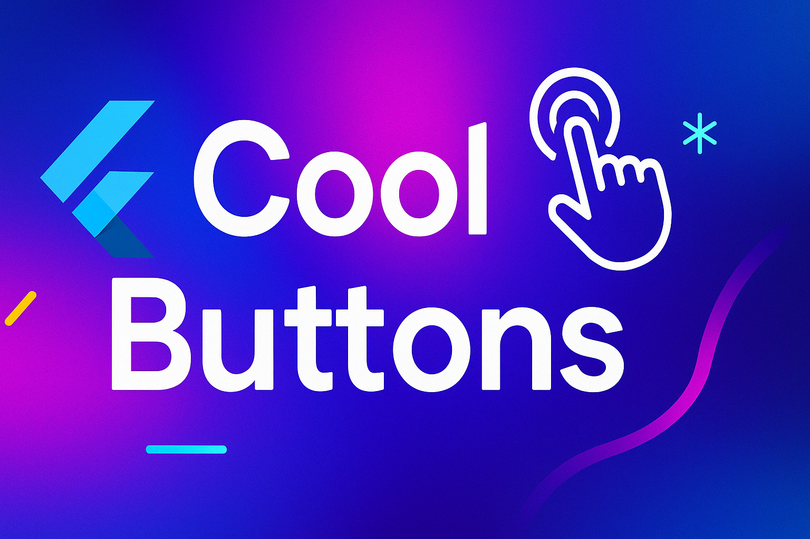

# Cool Buttons - Flutter Package

## Description-
### The Cool Buttons Flutter library (package:cool_buttons) is a collection of visually engaging, customizable button widgets designed to enhance the user interface of Flutter applications. It provides a variety of animated and stylized buttons, each with unique effects such as shimmering gradients, revolving animations, pulsating visuals, and futuristic designs, making them ideal for creating interactive and modern UI/UX experiences.
### (All preview at the bottom)
### My Github Repo-- https://github.com/Pratyush-who/Cool_Buttons_Package
### My Github -- https://github.com/Pratyush-who/

<p align="center">
  
</p>

## ✨ Features
- 11+ animated button styles
- Easy one-line integration
- Fully customizable
- Smooth 60fps animations

## ❶ Installation
Add to your `pubspec.yaml`:

```yaml
dependencies:
  cool_buttons: ^1.0.0


Then run:
flutter pub get

```

## 🛠 Usage
First import the package:
```yaml
import 'package:cool_buttons/cool_buttons.dart';
```

## Button Examples
### 1. Shimmer Button
```yaml
dart
ShimmerButton(
  text: "Login",
  onTap: () => print("Login pressed"),
)
```

### 2. Delete Button
```yaml
AnimatedDeleteButton(
  onDelete: () => _deleteItem(),
)
```
### 3. Checkout Button
```yaml
CheckoutButton(
  text: "Pay Now",
  onPressed: () => _processPayment(),
)
```

## 📸 Preview

| Button | Preview |
|--------|---------|
| **Shimmer Button** |  |
| **Sleek Outlined Button** |  |
| **Robotic Revolving Button** |  |
| **Animated Delete Button** |  |
| **Animated Get Started Button** |  |
| **Complete Order Button** |  |
| **Checkout Button** |  |
| **Epic Create Post Button** |  |
| **Futuristic Button** |  |
| **Dark Button** |  |
| **Get Started Button** |  |
